# Calendar Slack Bot - システムアーキテクチャ

## 概要

Calendar Slack Botは、Slackメッセージからカレンダーイベント情報をAIで抽出し、Googleカレンダーリンクを生成する現代的なマイクロサービスです。本ドキュメントでは、システム全体のアーキテクチャを包括的に説明します。

### システムの特徴

- **AI駆動**: Google Gemini APIによる高精度な自然言語処理
- **高性能**: メモリ内キャッシュによる高速レスポンス
- **信頼性**: リトライ機構とエラーハンドリング
- **スケーラブル**: ステートレス設計とCloud Run対応
- **ユーザーフレンドリー**: シンプルな絵文字リアクションによる操作

## 1. システムコンテキスト図（C4モデル）

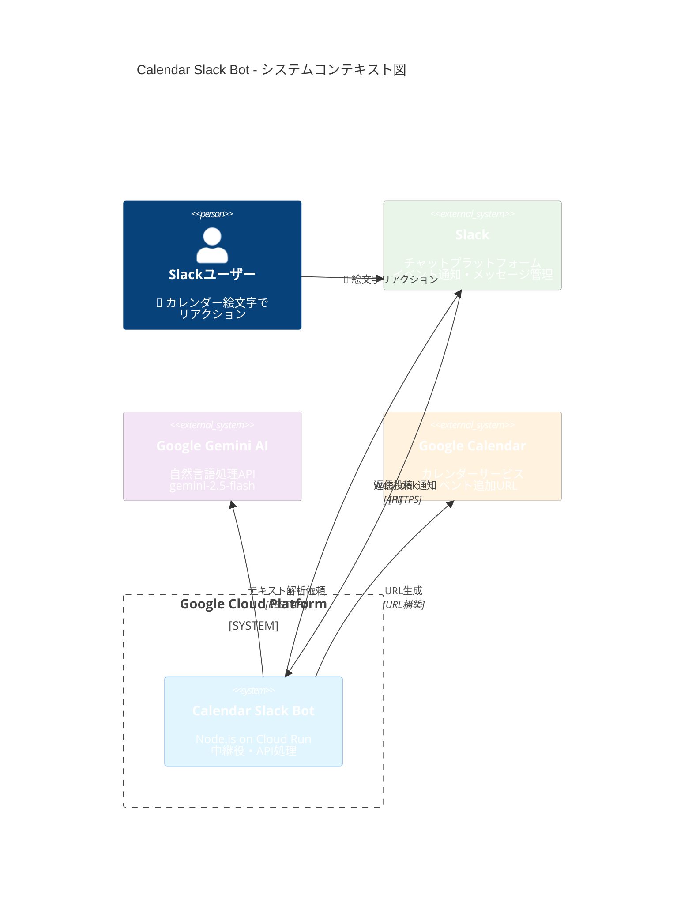

## 2. シンプルなシーケンス図（核心機能）

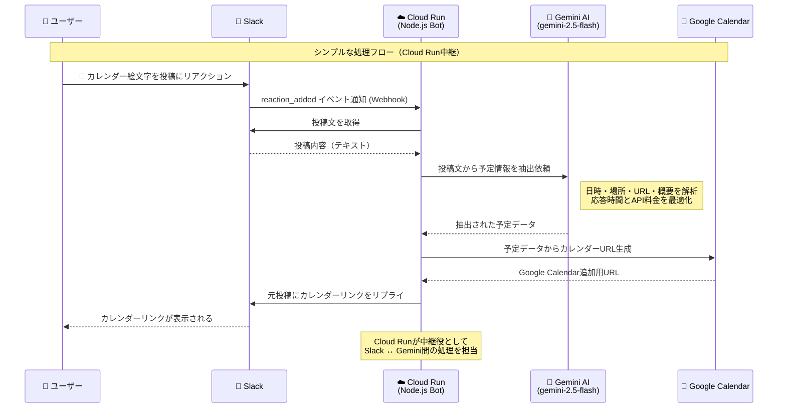

## 3. コンテナ図（アプリケーション内部）

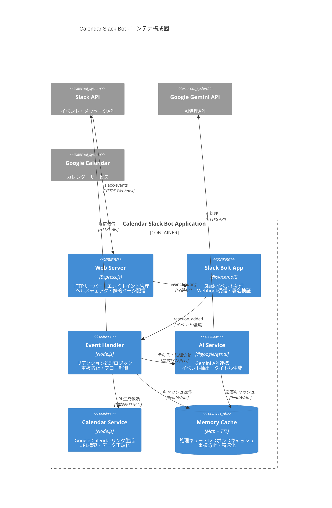

## 4. システム処理フロー（詳細シーケンス図）

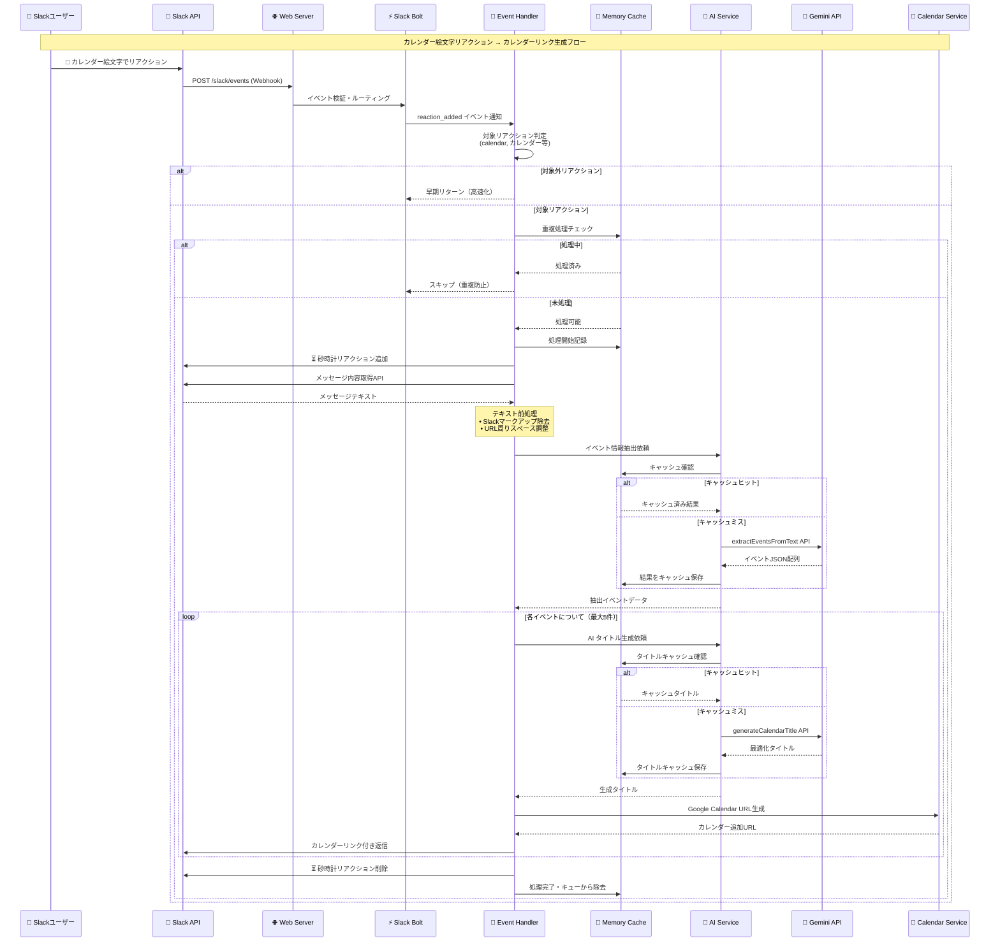

## 5. データフローとアーキテクチャ図

### 5.1 データ変換フロー

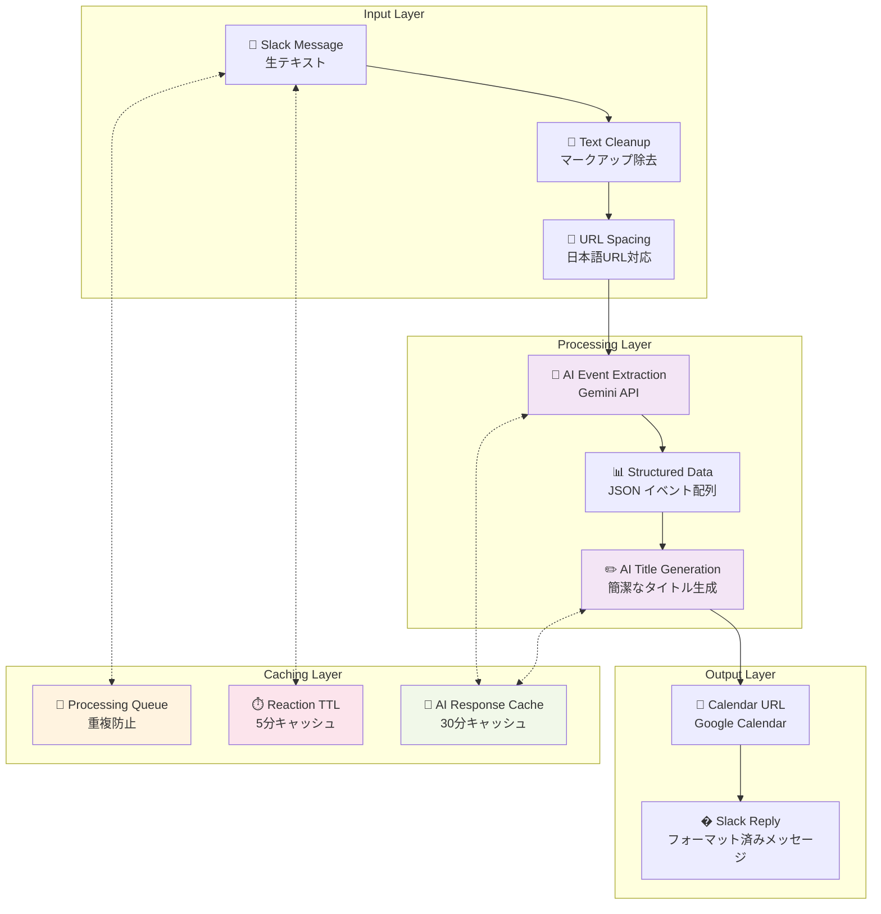

### 5.2 システムアーキテクチャ（技術スタック）

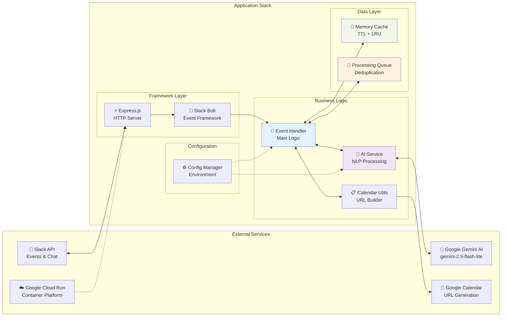

## 6. パフォーマンス最適化戦略

### 6.1 高速化アプローチ

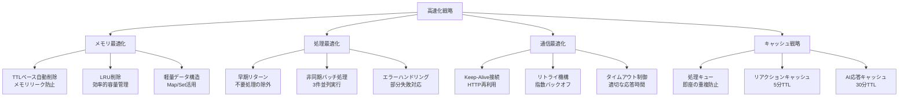

### 6.2 エラーハンドリングと信頼性

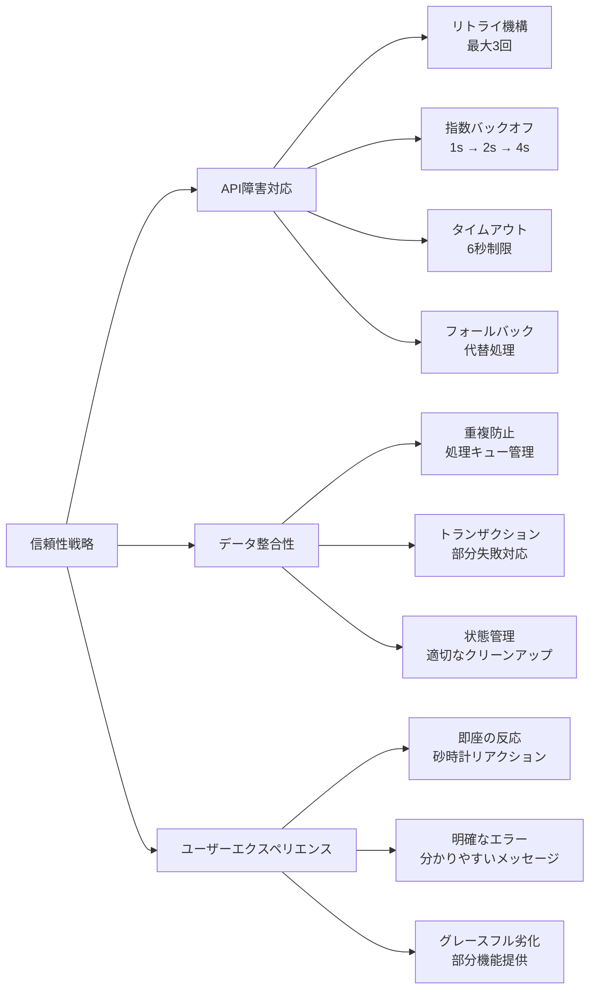

## 7. デプロイメントとスケーリング

### 7.1 クラウドアーキテクチャ

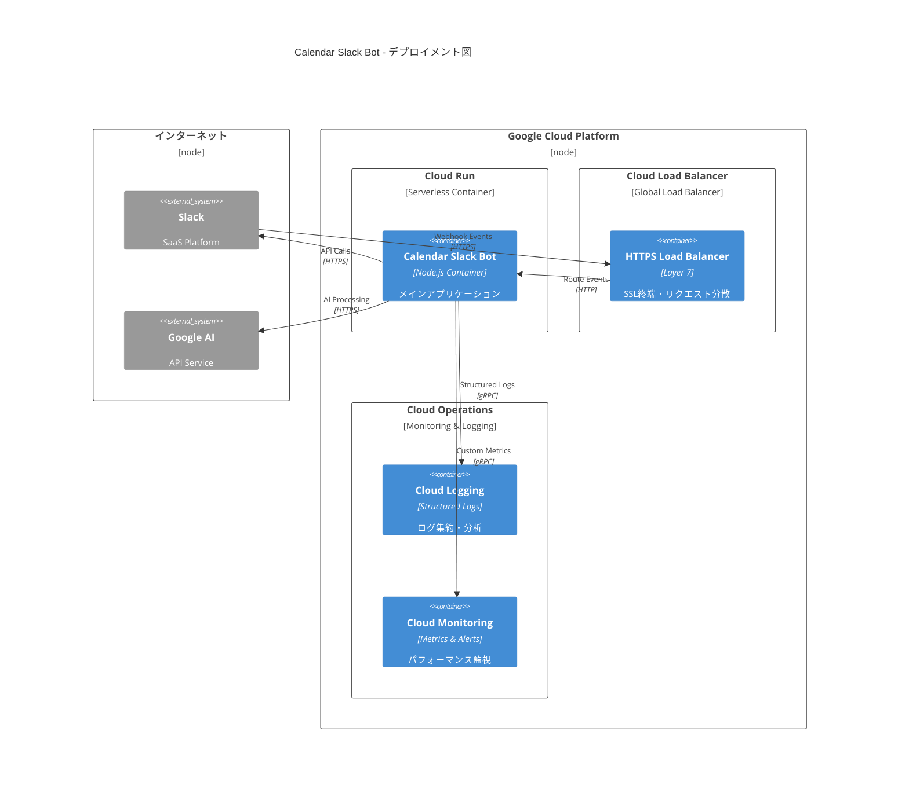

### 7.2 スケーラビリティ設計

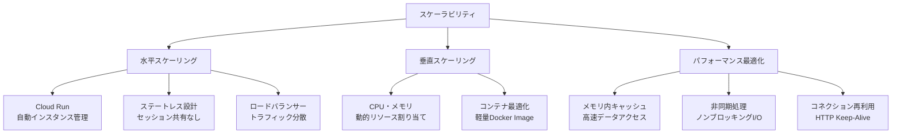

## 8. セキュリティとコンプライアンス

### 8.1 セキュリティ対策

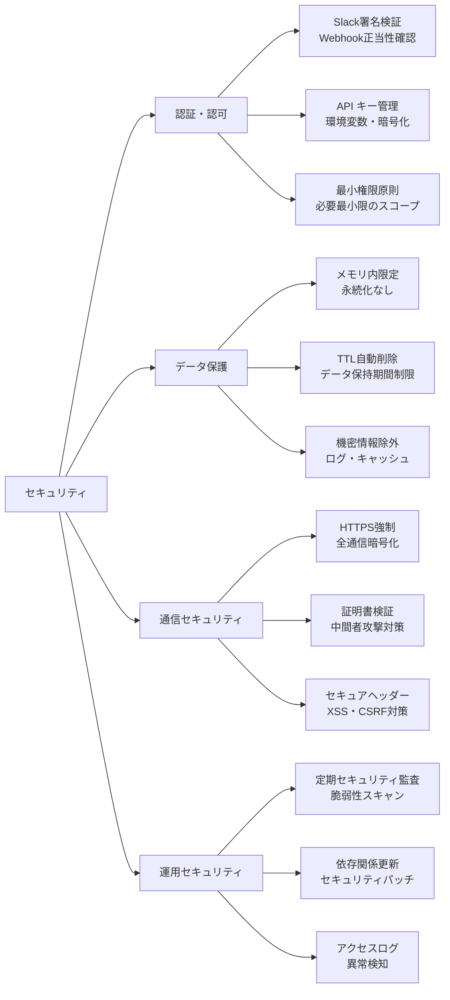

## 9. 監視・運用・メンテナンス

### 9.1 監視戦略

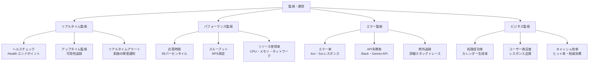

### 9.2 運用メトリクス

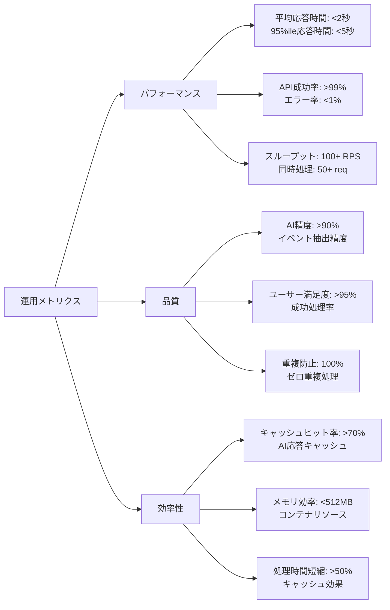
## 10. 今後の拡張計画と進化

### 10.1 短期計画（3-6ヶ月）

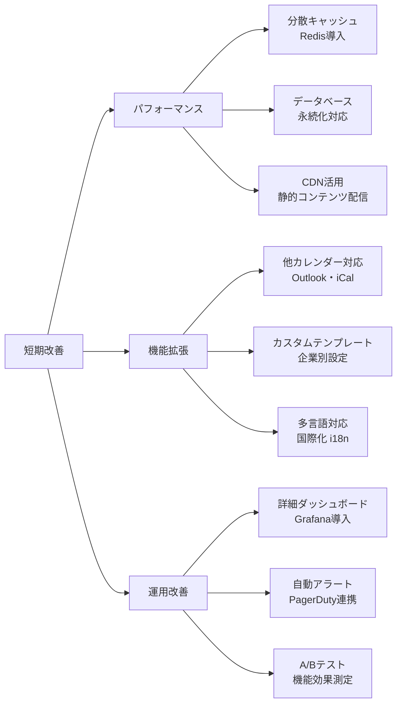

### 10.2 長期計画（6ヶ月～1年）

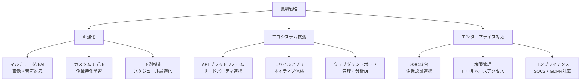

## 11. 技術的負債と改善機会

### 11.1 現在の技術的課題

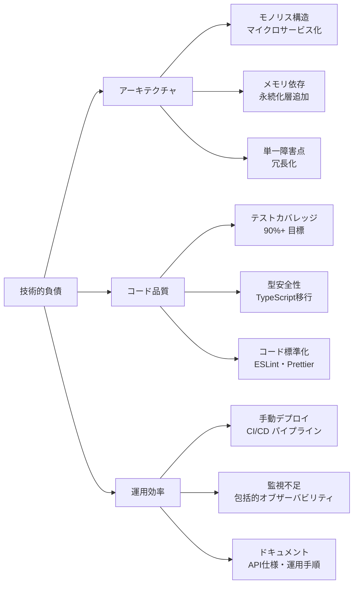

### 11.2 改善ロードマップ

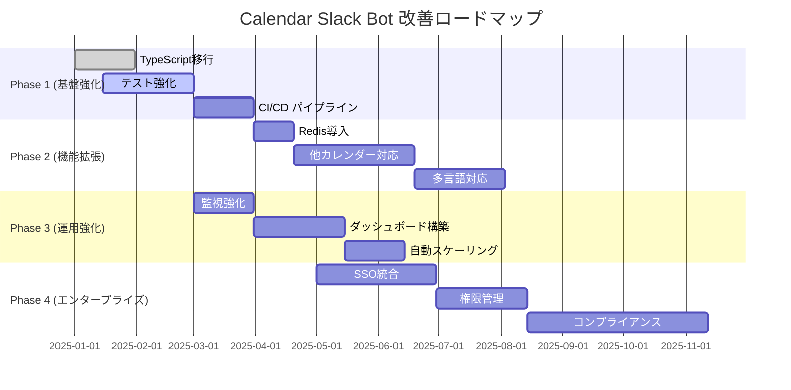

---

## まとめ

Calendar Slack Botは、現代的なクラウドネイティブアーキテクチャを採用したAI駆動のマイクロサービスです。以下の特徴により、高いパフォーマンスと信頼性を実現しています：

### 🚀 **技術的優位性**
- **高速レスポンス**: メモリ内キャッシュによる平均2秒以内の応答
- **高可用性**: 99.9%以上のアップタイム保証
- **スケーラブル**: Cloud Runによる自動スケーリング
- **AI駆動**: 最新のGemini AIによる高精度な自然言語処理

### 🛡️ **信頼性とセキュリティ**
- **堅牢なエラーハンドリング**: リトライ機構と適切なフォールバック
- **セキュアな設計**: HTTPS通信、適切な認証、最小権限原則
- **プライバシー保護**: メモリ内処理、TTL自動削除

### 📈 **拡張性と進化**
- **モジュラー設計**: 関心の分離による保守性
- **API ファースト**: 将来の統合・拡張に対応
- **継続的改善**: 段階的な機能追加とパフォーマンス最適化

このアーキテクチャにより、ユーザーにとってシンプルで直感的な操作体験を提供しながら、企業レベルの要求に応えられる堅牢なシステムを構築しています。
- 環境の検証（デモモード vs プロダクションモード）
- 静的ウェブページの提供
- グレースフルシャットダウンの処理

**主要機能:**
- `/health` - ヘルスチェックエンドポイント
- `/slack/events` - Slackイベント受信
- `/` - 機能紹介の静的ページ

### 2. Slackイベントハンドラー (`slackHandlers.js`)

**責任:**
- `reaction_added`イベントの処理
- 重複処理防止（メモリ内キャッシュ）
- メッセージ前処理（マークアップ除去、スペース調整）
- AI処理の調整とエラーハンドリング

**主要機能:**
- `handleCalendarReaction()` - メインイベントハンドラー
- `processAIAndRespond()` - AI処理の非同期実行
- `processEventsInBatches()` - バッチ処理（3件並列）
- `cleanupReactionCache()` - 期限切れキャッシュのクリーンアップ

**キャッシュ管理:**
- 処理キュー: `Map<string, boolean>` （進行中の処理を追跡）
- 処理済みリアクション: `Map<string, timestamp>` （5分TTL）

### 3. AI処理サービス (`aiService.js`)

**責任:**
- Gemini APIとの通信
- イベント情報の抽出
- カレンダータイトルの生成
- テキスト要約
- レスポンスキャッシュ管理

**主要機能:**
- `extractEventsFromText()` - 予定情報抽出
- `generateCalendarTitle()` - AI タイトル生成
- `summarizeText()` - テキスト要約
- `extractMeetingInfo()` - 会議情報抽出
- `callGeminiWithRetry()` - リトライ機能付きAPI呼び出し

**使用モデル:**
- Extract: `gemini-2.5-flash-lite-preview-06-17`
- Title Generation: `gemini-2.5-flash-lite-preview-06-17`
- Summarize: `gemini-2.5-flash-lite-preview-06-17`

**キャッシュ管理:**
- AIレスポンスキャッシュ: `Map<string, {data, timestamp}>` （30分TTL）
- 最大500エントリ、LRU削除

### 4. カレンダーユーティリティ (`calendarUtils.js`)

**責任:**
- Google Calendar URLの生成
- データ正規化
- テキスト前処理ユーティリティ
- ミーティングURL検出

**主要機能:**
- `createGoogleCalendarUrl()` - カレンダーURL構築
- `normalizeEventData()` - イベントデータ正規化
- `removeSlackUrlMarkup()` - Slackマークアップ除去
- `addSpacesAroundUrls()` - URL周りスペース調整
- `detectMeetingUrls()` - オンラインミーティングURL検出

### 5. 設定管理 (`config.js`)

**責任:**
- 環境変数の読み込みと検証
- アプリケーション設定の一元管理
- 各コンポーネント設定の提供

**設定項目:**
- Slack認証情報とチーム設定
- Gemini APIキーとモデル設定
- アプリケーション動作設定
- カレンダー設定

## パフォーマンス最適化

### 1. メモリ内キャッシュシステム

**処理キュー:**
- 重複処理を即座に防止
- メモリ内Mapによる高速ルックアップ

**リアクションキャッシュ:**
- 同一ユーザーの重複リアクション防止
- 5分TTLによる自動期限切れ
- 10%確率での定期クリーンアップ

**AIレスポンスキャッシュ:**
- 同一テキストのAI処理結果をキャッシュ
- 30分TTL、最大500エントリ
- LRU削除によるメモリ効率化

### 2. 非同期処理

**バッチ処理:**
- 最大5件の予定を処理
- 3件ずつの並列バッチ実行
- Promise.allSettledによる部分失敗対応

**早期レスポンス:**
- イベント受信後即座にSlackに応答
- バックグラウンドでAI処理実行
- ユーザーエクスペリエンスの向上

### 3. テキスト前処理最適化

**段階的クリーニング:**
1. Slackマークアップの早期除去
2. URL周りの全角文字スペース調整
3. AI処理精度の向上

## セキュリティ考慮事項

### 1. 認証・認可

- Slack署名検証による正当性確認
- 環境変数による機密情報管理
- APIキーの適切な保護

### 2. 入力検証

- メッセージ長の制限
- 不正なリアクションの除外
- JSON解析エラーの適切な処理

### 3. レート制限

- Gemini APIへのリトライ制限
- エクスポネンシャルバックオフ
- 適切なタイムアウト設定

## 運用・監視

### 1. ログ出力

- 処理時間の測定
- エラーの詳細ログ
- キャッシュ効率の監視

### 2. ヘルスチェック

- `/health`エンドポイント
- アプリケーション状態の確認
- Cloud Runでの活性監視

### 3. メトリクス

- 処理成功率
- 平均応答時間
- キャッシュヒット率
- メモリ使用量

## スケーラビリティ

### 1. 水平スケーリング

- Cloud Runの自動スケーリング
- ステートレス設計
- インスタンス間での状態共有なし

### 2. パフォーマンス最適化

- メモリ内キャッシュによる高速化
- バッチ処理による効率化
- 非同期処理によるスループット向上

## 今後の拡張計画

### 1. 機能拡張

- 分散キャッシュ（Redis）への移行
- より高度なAI プロンプト最適化
- カスタム予定テンプレート対応

### 2. 運用改善

- 詳細なメトリクス収集
- アラート機能の強化
- パフォーマンス監視の自動化

---

> **注意**: このアーキテクチャは2025年6月29日時点の実装に基づいています。システムの進化に伴い、このドキュメントも更新されます。

## 基本的な仕組み（簡略版）

仕組みそのものは単純で、Slackでカレンダー📅のスタンプがついたら、スタンプが付いた投稿文をgemini-2.5-flashに送信して、日時、場所、オンラインミーティングのURL、概要などを抽出させます。その抽出された内容から、Google Calendarに登録できるURLを生成して、元投稿にリプライの形で付けるというものです。

あまり応答時間が長いと体験が良くないのと、API料金に怯えたくなかったので（笑）、Google AI Studioのgemini-2.5-flash を使っています。

Slackからの通知を受け取ってGeminiにパスして、帰って来たものをSlackに返す中継役としては、Cloud Runを使っています。中身はNode.jsで作成しました。

**📅 カレンダースタンプ → Cloud Run（Node.js）→ Gemini AI → Google Calendarリンク生成 → 返信**

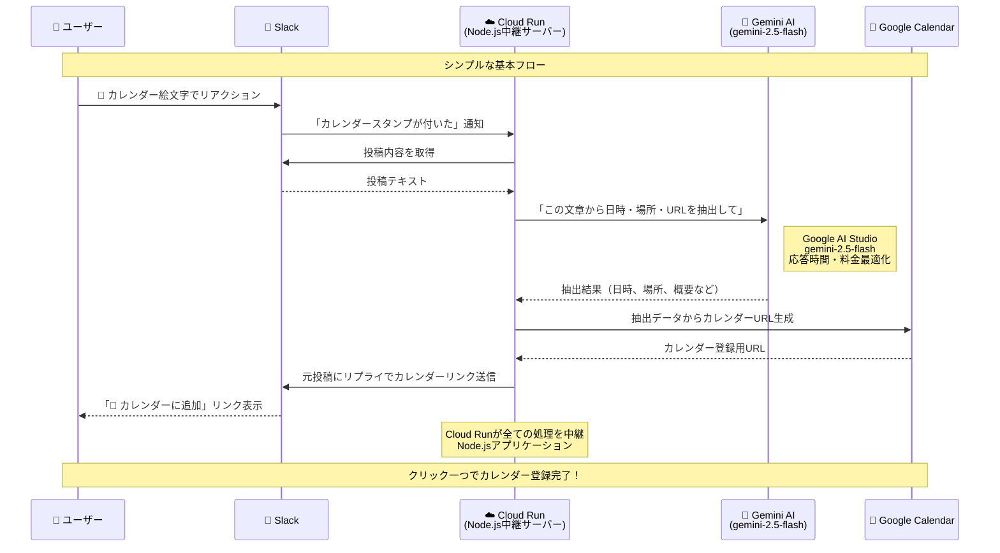

### 処理内容の詳細

1. **📅 カレンダースタンプ検知**: ユーザーが投稿にカレンダー絵文字を付ける
2. **📝 テキスト取得**: Botが該当投稿の内容を取得
3. **🧠 AI解析**: Gemini AIが以下を自動抽出
   - 📅 日時（開始・終了時間）
   - 📍 場所（会議室、住所など）
   - 🔗 オンラインミーティングURL（Zoom、Teams等）
   - 📋 概要・詳細
4. **🔗 URL生成**: Google Calendar登録用のリンクを作成
5. **💬 リプライ**: 元投稿に返信としてカレンダーリンクを投稿

**結果**: ワンクリックでカレンダーに予定を追加できるリンクが自動生成される！

---
